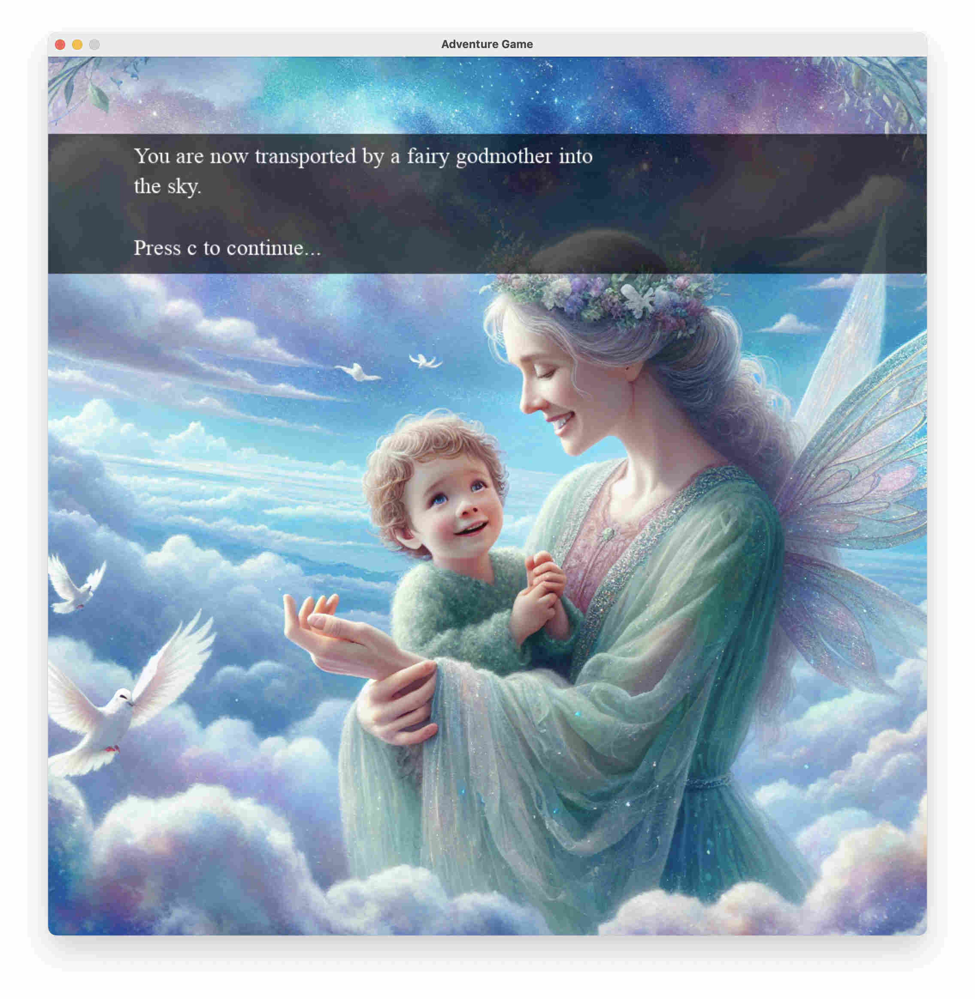

# Dall E Adventure



Welcome to the DALL-E Adventure game, an interactive game where players navigate through various whimsical and fantastical scenarios. This game essentially plays as a text-based adventure game. However, it also uses images generated by OpenAI's DALL-E 3 and integrates text-to-speech with gTTS to create an immersive experience for young children.

The gameplay advances linearly through various story scenes (that you can write with the child!). As you play, you are sometimes given a simple left or right choice. But be careful! If you choose the wrong direction, you get sent right back to the start!

In this way, the child is incentivised to figure out a way to remember the right answers as they go. This is a good problem for them to solve (with a bit of help from you) and adds a nice pen-and-paper element.

I wrote this game to have some fun with my child, who started school this year. It helps better distinguish left from right as well as improve some phonics, reading, writing, and comprehension skills.

But mostly, it's just fun to write the scripts and generate some wild images!

## Installation

1. Clone the repository:
    ```sh
    git clone https://github.com/yourusername/adventure-game.git
    cd adventure-game
    ```

2. Install the required dependencies:
    You might want to [set up an environment](https://docs.python.org/3/library/venv.html) first.
    ```sh
    pip install -r requirements.txt

## Usage

1. Ensure you have credits on your OpenAI account and you have set up the API key correctly. (See [here for a great walkthrough](https://platform.openai.com/docs/quickstart).)

2. Ensure you are connected to the internet for OpenAI image generation and Google text-to-speech

3. Run the game script:
    ```sh
    python image_gen_adventure.py
    ```
    The first run (and each time you change the location prompts) might take some time as the images generate via the Open AI API.

4. Follow the on-screen prompts to navigate through the adventure.

## Game Controls
The game controls should be explained in-game, but here is a reference of the controls:

- C Key: Continue to the next scene or prompt after reading the current text.
- L Key: Choose the left option when a choice is presented.
- R Key: Choose the right option when a choice is presented.
- S Key: Repeat the current prompt using text-to-speech.
- Window Close or X button: Exit the game.

## Writing Your Own Game

To write your own game modify the `locations` list of dictionaries. The images will be generated from the location prompts that you write the first time the game is run (or any time a prompt is changed and the game is run).

There are three types of location:

- Scene `answer = ""`: The location is just a plain scene where the user should press 'c' to continue. Write a location prompt to advance the story.
- Choice `answer = "l"` or `"r"`: The location is choice where the user should choose left or right. Write a location prompt that includes both left and right options.
- End `answer = "end"`: The location is the final winning scene. Write a location prompt to congratulate the player!

It's easier to understand by example. The current set of locations includes:

```python
locations = [
    {
        "answer": "",
        "prompt": "You are in the sea, up ahead you see lots of beautiful whales swimming.",
    },
    {
        "answer": "r",
        "prompt": "You get closer. There are two whales. The whale on the left is a humpback whale with skateboards. The whale on the right is a blue whale with roller skates. Which whale do you want to ride?",
    },
    {
        "answer": "",
        "prompt": "You are now transported by a fairy godmother into the sky.",
    },
    {
        "answer": "",
        "prompt": "You jump onto a unicorn and are riding high in the clouds.",
    },
    {
        "answer": "r",
        "prompt": "There are two more unicorns above your head. The unicorn on the left is covered with unicorn dust. The unicorn on the right is covered with wee wee and poo poo. Which unicorn do you choose?",
    },
    {
        "answer": "end",
        "prompt": "Amazing work, you have won a golden medal and a big enormous rainbow lollipop with silver and gold. I hope you will play again. Goodbye.",
    },
]
```

## Configuration

The game configuration can be adjusted through the following variables.

The `CHILD_AGE_TARGET` tries to restrict the image model from generating scary or disturbing pictures. It would be a good idea to view the generated files first before showing to your child:

```python
IMAGE_MODEL = "dall-e-3"
IMAGE_SIZE = "1024x1024"
IMAGE_QUALITY = "standard"
IMAGE_DIR = "images"
CHILD_AGE_TARGET = 3

SCREEN_WIDTH, SCREEN_HEIGHT = 1024, 1024
WHITE = (255, 255, 255)
BLACK = (0, 0, 0)
FONT_SIZE = 26
LINE_SPACING = 1.38
```

## License

This project is licensed under the MIT License.

---

Enjoy your adventure!